# 🚀 ICafe Forex Signal System v3.0 Enhanced


**Advanced Forex Signal Processing System with Anti-Duplicate Prevention, Signal Type Separation, and Comprehensive CRM Dashboard**

## 🎯 Key Features

### ✅ Enhanced Anti-Duplicate System
- **Smart Cooldown**: Configurable 50-second cooldown per symbol
- **JSON-based Cache**: Advanced caching with metadata tracking
- **Auto Cleanup**: Automatic cleanup of old cache entries
- **Real-time Statistics**: Complete duplicate prevention analytics
- **Per-Symbol Configuration**: Individual cooldown settings per trading pair

### ✅ Advanced Signal Type Separation
- **Buy/Sell Signals**: Basic trading signals with fixed emojis (▲/▼)
- **Breakout Signals**: High-priority breakout detection (🚀▲/💥▼)
- **Trend Signals**: Advanced trend analysis (📈▲/📉▼)
- **Support/Resistance**: Key level detection (🛡️/⛔)
- **Custom Signal Types**: Extensible signal system
- **Priority-based Processing**: Different priority levels for signal types

### ✅ Comprehensive CRM Dashboard
- **Real-time Analytics**: Live signal statistics and performance metrics
- **Symbol Management**: Advanced symbol configuration interface
- **Channel Routing**: Smart routing configuration (Telegram/EA/Both)
- **Health Monitoring**: System health and performance monitoring
- **Log Management**: Comprehensive logging and error tracking
- **User Session Tracking**: Complete audit trail

### ✅ Multi-Channel Integration
- **Telegram Channels**: Multiple Telegram channel support
- **EA Integration**: MetaTrader Expert Advisor compatibility
- **Flexible Routing**: Configure signals per channel per symbol
- **Channel Priority**: Priority-based channel selection
- **Backup Channels**: Automatic failover support

## 🔧 Quick Installation

### One-Line Installation (Recommended)

```bash
curl -fsSL https://raw.githubusercontent.com/siamcafe/icafe-forex-signal/main/install.sh | bash
```

### Manual Installation

```bash
# Clone the repository
git clone https://github.com/siamcafe/icafe-forex-signal.git
cd icafe-forex-signal

# Make setup script executable
chmod +x setup.sh

# Run installation
sudo ./setup.sh
```

## 📋 System Requirements

- **PHP**: 7.4 or higher
- **MySQL/MariaDB**: 5.7 or higher
- **Extensions**: mysqli, curl, json
- **Web Server**: Apache/Nginx
- **OS**: Linux (Ubuntu/CentOS/Debian)
- **Permissions**: Write access to target directory

## 🔗 API Endpoints

### Primary Endpoints

| Endpoint | Method | Description |
|----------|--------|-------------|
| `/webhook/notify.php` | POST | Enhanced JSON API for signal processing |
| `/webhook/send2.php?id={symbol_id}` | POST | Legacy EA format compatibility |
| `/webhook/config/` | GET | Configuration dashboard |
| `/webhook/crm/` | GET | CRM dashboard and analytics |
| `/webhook/notify.php?health` | GET | System health check |

### Configuration Endpoints

| Endpoint | Description |
|----------|-------------|
| `/webhook/config/api.php` | Configuration API |
| `/webhook/config/test_example.php` | Enhanced testing interface |
| `/webhook/crm/statistics.php` | Signal statistics API |
| `/webhook/crm/logs.php` | Signal logs viewer |

## 📊 Signal Processing Flow

```mermaid
graph TD
    A[📱 Signal Input] --> B{Authentication?}
    B -->|JA Found| C[🔍 Validate Input]
    B -->|No JA| D[🔄 Add JA & Convert]
    C --> E[🚫 Anti-Duplicate Check]
    D --> E
    E -->|Duplicate| F[⏸️ Block & Log]
    E -->|Valid| G[🎯 Signal Type Detection]
    G --> H[📊 Channel Routing]
    H --> I[📤 Send to Channels]
    I --> J[💾 Database Logging]
    J --> K[📈 Update Statistics]
    F --> L[📋 Return Status]
    K --> L
```



## 🎮 API Usage Examples

### Enhanced JSON API (notify.php)

#### Basic Buy Signal
```bash
curl -X POST https://icafeforex.com/webhook/notify.php \
  -H "Content-Type: application/json" \
  -d '{
    "status": "buy",
    "ticker": "XAUUSD",
    "price": "2050.25",
    "timeframe": "15m",
    "source": "JA"
  }'
```

#### Breakout Signal (High Priority)
```bash
curl -X POST https://icafeforex.com/webhook/notify.php \
  -H "Content-Type: application/json" \
  -d '{
    "status": "breakout_buy",
    "ticker": "BTCUSD",
    "price": "45000.00",
    "timeframe": "4H",
    "source": "JA"
  }'
```

#### Trend Analysis Signal
```bash
curl -X POST https://icafeforex.com/webhook/notify.php \
  -H "Content-Type: application/json" \
  -d '{
    "status": "trend_up",
    "ticker": "EURUSD",
    "price": "1.0850",
    "timeframe": "1D",
    "source": "JA"
  }'
```

### Legacy EA API (send2.php)

```bash
# Direct EA format
curl -X POST "https://icafeforex.com/webhook/send2.php?id=1" \
  -H "Content-Type: text/plain" \
  -d "buy,2050.25,JA,15"

# Breakout format
curl -X POST "https://icafeforex.com/webhook/send2.php?id=1" \
  -H "Content-Type: text/plain" \
  -d "buy,2050.25,Breakout Buy JA,240"
```

## 📈 Anti-Duplicate System

### How It Works

1. **Signal Reception**: Each signal is checked against cache
2. **Duplicate Detection**: Compares symbol + signal type + time
3. **Cooldown Check**: Validates against configurable cooldown period
4. **Smart Blocking**: Blocks duplicates while allowing genuine signals
5. **Statistics Tracking**: Logs all duplicate attempts for analytics

### Configuration

```php
// Per-symbol cooldown configuration
$cooldownSettings = [
    'XAUUSD' => 50,    // 50 seconds
    'EURUSD' => 30,    // 30 seconds  
    'BTCUSD' => 120,   // 2 minutes (volatile)
];
```

### Cache Structure

```json
{
    "_metadata": {
        "version": "3.0",
        "total_signals": 15847,
        "total_duplicates_blocked": 1205,
        "last_cleanup": "2024-01-15T10:30:00Z"
    },
    "signals": {
        "XAUUSD_buy": {
            "timestamp": 1705312200,
            "price": "2050.25",
            "signal_type": "buy",
            "last_updated": "2024-01-15T10:30:00Z"
        }
    }
}
```

## 🎯 Signal Types & Emojis

### Fixed Emoji System (v3.0)

| Signal Type | Emoji | Description | Priority |
|-------------|-------|-------------|----------|
| `buy` | ▲ | Basic buy signal | Normal |
| `sell` | ▼ | Basic sell signal | Normal |
| `breakout_buy` | 🚀▲ | Breakout buy signal | Critical |
| `breakout_sell` | 💥▼ | Breakout sell signal | Critical |
| `trend_up` | 📈▲ | Uptrend analysis | High |
| `trend_down` | 📉▼ | Downtrend analysis | High |
| `support` | 🛡️ | Support level | Normal |
| `resistance` | ⛔ | Resistance level | Normal |
| `reversal` | 🔄 | Reversal pattern | High |
| `consolidation` | ⚖️ | Consolidation | Low |

### Signal Message Templates

#### Buy/Sell Signals
```
🐱✨ แจ้งเตือนสัญญาณ Enhanced v3.0
💰 คู่เงิน: XAUUSD
▲ สถานะ: BUY
📊 ราคา: 2050.25
🕒 TF: M15
📅 เวลา: 15 Jan 2024, 10:30 น.

✨ #ICafe_Enhanced | Anti-Duplicate System Active
```

#### Breakout Signals
```
🚀▲⚡ BREAKOUT ALERT!! ⚡
💰 คู่เงิน: BTCUSD
▲ สถานะ: BREAKOUT BUY
💸 ราคา: 45000.00
🔁 TF: H4
⏱ เวลา: 15 Jan 2024, 10:30 น.

🚨 HIGH PRIORITY SIGNAL 🚨
✨ #ICafe_Breakout | Enhanced Detection System
```

## 🏗️ Database Schema

### Enhanced Tables

```sql
-- Signal logs with comprehensive tracking
CREATE TABLE signal_logs (
    id INT AUTO_INCREMENT PRIMARY KEY,
    symbol_id INT NOT NULL,
    symbol_code VARCHAR(20) NOT NULL,
    signal_type VARCHAR(50) NOT NULL,
    price DECIMAL(12,5) NOT NULL,
    timeframe VARCHAR(10) NOT NULL,
    status ENUM('success', 'failed', 'duplicate', 'skipped') DEFAULT 'success',
    message_sent TEXT,
    telegram_sent BOOLEAN DEFAULT FALSE,
    ea_sent BOOLEAN DEFAULT FALSE,
    channels_sent JSON,
    processing_method VARCHAR(50),
    sent_at TIMESTAMP DEFAULT CURRENT_TIMESTAMP,
    response_data JSON
);

-- Real-time statistics
CREATE TABLE signal_statistics (
    symbol_code VARCHAR(20) NOT NULL,
    signal_type VARCHAR(50) NOT NULL,
    total_sent INT DEFAULT 0,
    successful_sent INT DEFAULT 0,
    failed_sent INT DEFAULT 0,
    duplicate_blocked INT DEFAULT 0,
    stats_date DATE NOT NULL,
    PRIMARY KEY (symbol_code, signal_type, stats_date)
);

-- Enhanced symbol settings
ALTER TABLE symbol_settings 
ADD COLUMN signal_type ENUM('telegram_only', 'ea_only', 'both') DEFAULT 'both',
ADD COLUMN anti_duplicate_seconds INT DEFAULT 50,
ADD COLUMN priority_level ENUM('low', 'normal', 'high', 'critical') DEFAULT 'normal',
ADD COLUMN custom_emoji VARCHAR(20) DEFAULT NULL,
ADD COLUMN is_active BOOLEAN DEFAULT TRUE;
```

## 📊 CRM Dashboard Features

### Dashboard Overview
- **Real-time Statistics**: Live signal counts and success rates
- **Performance Metrics**: Channel-wise performance analytics
- **Duplicate Prevention**: Anti-duplicate system statistics
- **System Health**: Component health monitoring

### Analytics Features
- **Signal Distribution**: Signal type distribution charts
- **Success Rate Trends**: Historical success rate analysis
- **Channel Performance**: Per-channel delivery statistics
- **Symbol Activity**: Most active trading pairs

### Management Tools
- **Symbol Configuration**: Bulk symbol settings management
- **Channel Routing**: Advanced channel routing configuration
- **User Session Tracking**: Complete audit trail
- **Log Management**: Comprehensive log viewing and filtering

## 🔒 Security Features

### Authentication & Authorization
- **JA Identifier**: Required authentication token
- **IP Logging**: Complete IP address tracking
- **Session Management**: Secure session handling
- **Access Control**: Role-based access control

### Input Validation
- **SQL Injection Prevention**: Prepared statements
- **XSS Protection**: Input sanitization
- **CSRF Protection**: Cross-site request forgery protection
- **Rate Limiting**: Request rate limiting

### Data Protection
- **Encrypted Storage**: Sensitive data encryption
- **Secure Transmission**: HTTPS enforcement
- **Audit Trail**: Complete activity logging
- **Backup Security**: Encrypted backups

## 🛠️ Configuration

### Symbol Configuration

```php
// Configure symbols via config panel or database
INSERT INTO symbol_settings (
    symbol_id, 
    signal_type, 
    anti_duplicate_seconds,
    priority_level,
    channel_icafe_signal,
    is_active
) VALUES (
    1,           -- XAUUSD
    'both',      -- Send to both Telegram and EA
    50,          -- 50-second cooldown
    'high',      -- High priority
    1,           -- Enable signal channel
    1            -- Active
);
```

### Channel Configuration

```php
// Channel routing configuration
$channelConfig = [
    'XAUUSD' => [
        'telegram' => ['test', 'signal', 'gold'],
        'ea' => true,
        'snapshot' => true,
        'priority' => 'high'
    ],
    'EURUSD' => [
        'telegram' => ['signal'],
        'ea' => true,
        'snapshot' => false,
        'priority' => 'normal'
    ]
];
```

## 📝 Logging System

### Log Files

| Log File | Purpose |
|----------|---------|
| `signal_logs.log` | All signal processing activities |
| `duplicate_logs.log` | Duplicate prevention logs |
| `error_logs.log` | System errors and exceptions |
| `system_health.log` | System health monitoring |
| `crm_access.log` | CRM dashboard access logs |

### Log Format

```
[2024-01-15 10:30:25] SIGNAL: XAUUSD | buy | 2050.25 | success | Signal sent to: signal, gold
[2024-01-15 10:30:45] DUPLICATE_BLOCKED: XAUUSD | buy | TimeDiff: 20s | Cooldown: 50s
[2024-01-15 10:31:00] ERROR: Failed to send to gold channel: Connection timeout
```

## 🚀 Performance Optimization

### Caching Strategy
- **JSON-based Cache**: Fast file-based caching
- **Memory Optimization**: Efficient memory usage
- **Auto Cleanup**: Automatic cache cleanup
- **Cache Statistics**: Real-time cache performance

### Database Optimization
- **Indexed Queries**: Optimized database queries
- **Connection Pooling**: Efficient connection management
- **Query Optimization**: Optimized SQL queries
- **Statistics Aggregation**: Efficient statistics calculation

### Resource Management
- **CPU Optimization**: Efficient processing algorithms
- **Memory Management**: Optimal memory usage
- **Disk I/O**: Optimized file operations
- **Network Efficiency**: Optimized API calls

## 🧪 Testing

### Automated Testing
```bash
# Run comprehensive test suite
bash tests/run_tests.sh

# Test specific signal types
bash tests/test_signal_types.sh

# Test anti-duplicate system
bash tests/test_anti_duplicate.sh
```

### Manual Testing Interface
- **Interactive Testing**: Web-based testing interface
- **Signal Simulation**: Simulate various signal types
- **Channel Testing**: Test individual channels
- **Performance Testing**: Load testing capabilities

## 📚 API Documentation

### Complete API Reference
- **Endpoint Documentation**: Detailed endpoint documentation
- **Request/Response Examples**: Complete examples
- **Error Codes**: Comprehensive error code reference
- **Rate Limiting**: API rate limiting information

### Integration Guides
- **TradingView Integration**: Connect TradingView alerts
- **MT4/MT5 Integration**: Expert Advisor integration
- **Custom Integration**: Build custom integrations
- **Webhook Configuration**: Webhook setup guides

## 🤝 Contributing

### Development Setup
```bash
# Clone repository
git clone https://github.com/siamcafe/icafe-forex-signal.git
cd icafe-forex-signal

# Install development dependencies
composer install
npm install

# Setup development environment
cp .env.example .env
php artisan migrate
```

### Code Standards
- **PSR-12**: Follow PSR-12 coding standards
- **Documentation**: Document all functions
- **Testing**: Write tests for new features
- **Security**: Follow security best practices

## 📄 License

This project is licensed under the MIT License - see the [LICENSE](LICENSE) file for details.

## 🆘 Support

### Documentation
- **Installation Guide**: Complete installation documentation
- **Configuration Guide**: Detailed configuration instructions
- **API Reference**: Complete API documentation
- **Troubleshooting**: Common issues and solutions

### Community Support
- **GitHub Issues**: Report bugs and request features
- **Discord Channel**: Real-time community support
- **Documentation Wiki**: Community-maintained documentation
- **Video Tutorials**: Step-by-step video guides

### Professional Support
- **Consulting Services**: Professional implementation services
- **Custom Development**: Custom feature development
- **Training**: Training and workshops
- **Maintenance**: Ongoing maintenance and support

---

## 🎉 Quick Start

1. **Install**: `curl -fsSL https://raw.githubusercontent.com/siamcafe/icafe-forex-signal/main/install.sh | bash`
2. **Configure**: Visit `https://your-domain.com/webhook/config/`
3. **Test**: Use the testing interface at `https://your-domain.com/webhook/config/test_example.php`
4. **Monitor**: Check the CRM dashboard at `https://your-domain.com/webhook/crm/`

**Your enhanced ICafe Forex Signal System v3.0 is ready! 🚀**

---

*Made with ❤️ by the ICafe Forex Team*
