# 🚀 ICafe Forex Signal System v3.0 Enhanced

[](https://opensource.org/licenses/MIT)
[](https://php.net/)
[](https://mysql.com/)
[](https://github.com/YOUR_USERNAME/icafe-forex-signal)

**Advanced Forex Signal Processing System with Anti-Duplicate Prevention, Signal Type Separation, and Comprehensive CRM Dashboard**

---

## 📋 Table of Contents

- [🎯 Features](#-features)
- [🚀 Quick Installation](#-quick-installation) 
- [📊 System Architecture](#-system-architecture)
- [🔧 Configuration](#-configuration)
- [📡 API Documentation](#-api-documentation)
- [🎮 Testing](#-testing)
- [📈 CRM Dashboard](#-crm-dashboard)
- [🛡️ Security Features](#️-security-features)
- [📁 File Structure](#-file-structure)
- [🔄 Migration Guide](#-migration-guide)
- [🆘 Troubleshooting](#-troubleshooting)
- [📞 Support](#-support)

---

## 🎯 Features

### ✨ **Enhanced Anti-Duplicate System**
- **Smart Cooldown**: Configurable cooldown periods per symbol (default: 50 seconds)
- **Advanced Caching**: JSON-based caching with metadata tracking
- **Auto Cleanup**: Automatic cleanup of old cache entries
- **Real-time Statistics**: Complete duplicate prevention analytics
- **Per-Signal Type**: Different cooldowns for different signal types

### 🎨 **Fixed Emoji System**
- **Buy Signals**: ▲ (Triangle up - FIXED from 🔺)
- **Sell Signals**: ▼ (Triangle down - FIXED from 🔻)
- **Breakout Buy**: 🚀▲ (Rocket + Triangle up)
- **Breakout Sell**: 💥▼ (Explosion + Triangle down)
- **Trend Up**: 📈▲ (Chart up + Triangle up)
- **Trend Down**: 📉▼ (Chart down + Triangle down)

### 🎯 **Advanced Signal Type Separation**
- **Basic Signals**: `buy`, `sell`
- **Breakout Signals**: `breakout_buy`, `breakout_sell` (High Priority)
- **Trend Signals**: `trend_up`, `trend_down`
- **Level Signals**: `support`, `resistance`
- **Pattern Signals**: `reversal`, `consolidation`
- **Custom Signals**: Extensible signal type system

### 📊 **Comprehensive CRM Dashboard**
- **Real-time Analytics**: Live signal statistics and performance metrics
- **Symbol Management**: Advanced symbol configuration interface
- **Channel Routing**: Smart routing configuration (Telegram/EA/Both)
- **Health Monitoring**: System component health tracking
- **Log Management**: Advanced filtering and search capabilities
- **Performance Metrics**: Success rates, duplicate prevention stats

### 🔗 **Multi-Channel Integration**
- **Telegram Channels**: Multiple channel support with smart routing
- **EA/MT4 Integration**: Legacy Expert Advisor compatibility
- **Test Channels**: Dedicated testing environments
- **Priority Routing**: High-priority signals get priority delivery

### 🛡️ **Enterprise Security**
- **JA Authentication**: Required JA identifier system
- **Input Validation**: Comprehensive data validation and sanitization
- **SQL Injection Prevention**: Prepared statements throughout
- **Access Control**: IP-based access logging and monitoring
- **Session Management**: Secure session handling for CRM access

---

## 🚀 Quick Installation

### One-Line Installation (Recommended)

```bash
curl -fsSL https://raw.githubusercontent.com/siamcafe/icafe-forex-signal/main/install.sh | bash
```

### Manual Installation

```bash
# Clone repository
git clone https://github.com/siamcafe/icafe-forex-signal.git
cd icafe-forex-signal

# Make setup script executable
chmod +x setup.sh

# Run installation
sudo ./setup.sh
```

### Installation Requirements

- **PHP**: >= 7.4 with extensions: mysqli, curl, json
- **MySQL/MariaDB**: >= 5.7
- **Web Server**: Apache/Nginx with PHP support
- **System Access**: Root privileges or write access to target directory
- **Network**: Internet access for external API calls

---

## 📊 System Architecture

```mermaid
graph TD
    A[📱 Trading Signal Input] --> B{Signal Source?}
    B -->|JSON API| C[📋 notify.php]
    B -->|Legacy EA| D[🔧 send2.php]
    
    C --> E[🔍 Input Validation]
    D --> E
    
    E --> F{Valid Signal?}
    F -->|No| G[❌ Return Error]
    F -->|Yes| H[🔐 JA Authentication Check]
    
    H --> I{Has JA Identifier?}
    I -->|No| J[🔄 Convert to EA Format + Add JA]
    I -->|Yes| K[📊 Parse Signal Type]
    J --> K
    
    K --> L[🚫 Anti-Duplicate Check]
    L --> M{Recently Sent?}
    M -->|Yes| N[⏸️ Skip + Log Duplicate]
    M -->|No| O[📝 Update Cache + Process]
    
    O --> P[🎯 Channel Routing Logic]
    P --> Q{Signal Type Config}
    Q -->|telegram_only| R[📢 Telegram Only]
    Q -->|ea_only| S[🤖 EA Only]
    Q -->|both| T[📢🤖 Both Channels]
    
    R --> U[💾 Database Logging]
    S --> U
    T --> U
    
    U --> V[📊 CRM Statistics Update]
    V --> W[✅ Success Response]
    
    N --> X[⚠️ Duplicate Response]
    G --> Y[📝 Error Logging]
```



---

## 🔧 Configuration

### 📁 Installation Paths

```
Target Path: /home/icafefor/domains/icafeforex.com/public_html/
├── webhook/
│   ├── config/           # Configuration dashboard
│   ├── crm/             # CRM dashboard
│   ├── logs/            # System logs
│   ├── backup/          # Auto backups
│   ├── notify.php       # JSON API endpoint
│   ├── send2.php        # Legacy EA endpoint
│   ├── telegram.php     # Core Telegram system
│   └── last_sent.json   # Anti-duplicate cache
├── database/
│   └── enhanced_schema.sql
└── INSTALLATION_SUMMARY.md
```

### ⚙️ Symbol Configuration

Access the configuration panel at: `https://icafeforex.com/webhook/config/`

**Available Settings per Symbol:**
- **Snapshot**: Enable/disable chart snapshots
- **ICafe Gold**: Route to gold channel
- **ICafe Signal**: Route to signal channel  
- **ICafe Test**: Route to test channel
- **Signal Type**: `telegram_only`, `ea_only`, `both`
- **Anti-Duplicate Seconds**: Custom cooldown period
- **Priority Level**: `low`, `normal`, `high`, `critical`
- **Custom Emoji**: Override default emoji
- **Active Status**: Enable/disable symbol

### 🎛️ Database Configuration

The system uses the following database structure:

```sql
-- Core Tables
- symbols                # Trading symbol definitions
- symbol_settings       # Per-symbol configuration
- signal_logs           # Complete signal processing history
- signal_statistics     # Daily/monthly statistics
- user_sessions         # CRM user session tracking
- system_health         # Component health monitoring
```

---

## 📡 API Documentation

### 🔗 Endpoints

| Endpoint | Method | Purpose | Format |
|----------|--------|---------|---------|
| `/webhook/notify.php` | POST | JSON API | JSON |
| `/webhook/send2.php?id={symbol_id}` | POST | Legacy EA | Plain Text |
| `/webhook/notify.php?health` | GET | Health Check | JSON |
| `/webhook/config/` | GET | Configuration Panel | HTML |
| `/webhook/crm/` | GET | CRM Dashboard | HTML |

### 📤 JSON API Usage

**Endpoint:** `POST /webhook/notify.php`

**Basic Signal Example:**
```json
{
  "status": "buy",
  "ticker": "XAUUSD",
  "price": "2050.25",
  "timeframe": "15m",
  "source": "JA"
}
```

**Advanced Signal Example:**
```json
{
  "status": "breakout_buy",
  "ticker": "BTCUSD", 
  "price": "45000.00",
  "timeframe": "4H",
  "source": "JA",
  "comment": "Strong resistance breakout",
  "strategy": "Momentum Trading"
}
```

**Response Example:**
```json
{
  "status": "success",
  "message": "Signal sent successfully",
  "signal_type": "breakout_buy",
  "ticker": "BTCUSD",
  "price": "45000.00",
  "method_used": "dynamic_status",
  "channels_sent": ["telegram", "ea"],
  "anti_duplicate": {
    "is_duplicate": false,
    "next_allowed": "2024-01-15T10:31:25Z"
  },
  "timestamp": "2024-01-15T10:30:25Z"
}
```

### 🤖 Legacy EA API Usage

**Endpoint:** `POST /webhook/send2.php?id={symbol_id}`

**Format:** `{action},{price},{info},{timeframe}`

**Examples:**
```bash
# Basic buy signal
curl -X POST "https://icafeforex.com/webhook/send2.php?id=1" \
  -d "buy,2050.25,JA,60"

# Breakout sell signal  
curl -X POST "https://icafeforex.com/webhook/send2.php?id=17" \
  -d "sell,1.0850,Breakout Sell JA,240"
```

### 🏥 Health Check API

**Endpoint:** `GET /webhook/notify.php?health`

**Response:**
```json
{
  "status": "healthy",
  "service": "ICafe Forex Signal System v3.0",
  "components": {
    "telegram_bot": "healthy",
    "database": "healthy", 
    "anti_duplicate": "healthy",
    "cache_system": "healthy"
  },
  "statistics": {
    "total_signals_today": 142,
    "success_rate": 94.2,
    "duplicates_blocked_today": 23,
    "active_symbols": 28
  },
  "timestamp": "2024-01-15T10:30:25Z"
}
```

---

## 🎮 Testing

### 🧪 Testing Interface

Access the comprehensive testing interface at:
`https://icafeforex.com/webhook/config/test_example.php`

**Features:**
- **Quick Test Buttons**: One-click testing for all signal types
- **Custom Signal Builder**: Build and test custom signals
- **Real-time Results**: See immediate API responses
- **Emoji Verification**: Verify fixed emoji system
- **Batch Testing**: Test multiple signals simultaneously

### 🔧 Manual Testing Examples

**Test Buy Signal:**
```bash
curl -X POST https://icafeforex.com/webhook/notify.php \
  -H "Content-Type: application/json" \
  -d '{
    "status": "buy",
    "ticker": "XAUUSD", 
    "price": "2050.25",
    "timeframe": "15m",
    "source": "JA"
  }'
```

**Test Breakout Signal:**
```bash
curl -X POST https://icafeforex.com/webhook/notify.php \
  -H "Content-Type: application/json" \
  -d '{
    "status": "breakout_buy",
    "ticker": "BTCUSD",
    "price": "45000",
    "timeframe": "4H",
    "source": "JA"
  }'
```

**Test Anti-Duplicate (send same signal twice):**
```bash
# First signal - should succeed
curl -X POST https://icafeforex.com/webhook/notify.php \
  -H "Content-Type: application/json" \
  -d '{"status": "buy", "ticker": "EURUSD", "price": "1.0850", "timeframe": "1H", "source": "JA"}'

# Second signal (within 50 seconds) - should be blocked
curl -X POST https://icafeforex.com/webhook/notify.php \
  -H "Content-Type: application/json" \
  -d '{"status": "buy", "ticker": "EURUSD", "price": "1.0851", "timeframe": "1H", "source": "JA"}'
```

---

## 📈 CRM Dashboard

### 🖥️ Dashboard Features

Access the CRM dashboard at: `https://icafeforex.com/webhook/crm/`

**Main Dashboard:**
- **Real-time Statistics**: Live signal counts, success rates
- **Performance Metrics**: Channel-wise performance analytics  
- **Signal Activity Charts**: Historical signal volume charts
- **Recent Signals Table**: Latest signal processing results
- **System Health Status**: Component health monitoring

**Advanced Analytics:**
- **Symbol Performance**: Per-symbol success rates and volumes
- **Signal Type Analysis**: Breakdown by signal types
- **Duplicate Prevention Stats**: Anti-duplicate system effectiveness
- **Channel Efficiency**: Telegram vs EA delivery success rates
- **Time-based Analytics**: Hourly, daily, weekly trends

**Log Management:**
- **Signal Logs**: Complete signal processing history
- **Error Logs**: System errors and debugging information
- **Duplicate Logs**: Blocked duplicate signal attempts
- **System Health Logs**: Component health monitoring logs
- **CRM Access Logs**: Dashboard usage tracking

### 📊 Dashboard Screenshots

**Main Dashboard Overview:**
- Real-time signal statistics cards
- Interactive charts for signal activity
- Recent signals table with filtering
- System health indicators

**Analytics Page:**
- Advanced signal type breakdown
- Symbol performance comparisons  
- Success rate trends over time
- Channel routing effectiveness

**Symbol Management:**
- Per-symbol configuration interface
- Bulk configuration updates
- Symbol activity monitoring
- Custom emoji and cooldown settings

---

## 🛡️ Security Features

### 🔐 Authentication System

**JA Identifier Requirement:**
- All signals must contain "JA" identifier
- Automatic rejection of non-authenticated signals
- Multiple validation points (source, comment, strategy fields)

**Access Control:**
- IP-based access logging
- Session management for CRM access
- Rate limiting protection
- Input validation and sanitization

### 🛡️ Data Protection

**SQL Injection Prevention:**
- Prepared statements throughout the system
- Input parameter binding
- Data type validation

**XSS Protection:**
- HTML entity encoding
- Content Security Policy headers
- Input sanitization

**File Security:**
- Protected log directories
- Secure file permissions
- Access restriction via .htaccess

---

## 📁 File Structure

```
icafe-forex-signal/
├── 📄 README.md                          # This documentation
├── 🔧 install.sh                         # GitHub one-line installer
├── ⚙️ setup.sh                          # Manual setup script
├── 📁 webhook/
│   ├── 📋 notify.php                     # Enhanced JSON API endpoint
│   ├── 🔧 send2.php                      # Enhanced legacy EA endpoint  
│   ├── 📱 telegram.php                   # Core Telegram system with anti-duplicate
│   ├── 🗄️ db.php                        # Database connection
│   ├── 📄 last_sent.json                # Enhanced anti-duplicate cache
│   ├── 🏥 health.php                     # System health monitoring
│   ├── 📁 config/
│   │   ├── 🖥️ index.php                 # Main configuration dashboard
│   │   ├── 🔗 api.php                   # Configuration API endpoints
│   │   ├── 🧪 test_example.php          # Comprehensive testing interface
│   │   └── 🔬 test.php                  # Simple testing page
│   ├── 📁 crm/
│   │   ├── 📊 index.php                 # Main CRM dashboard
│   │   ├── 📈 analytics.php             # Advanced analytics page
│   │   ├── 📝 logs.php                  # Log management interface
│   │   ├── 🔧 settings.php              # System settings
│   │   └── 🏥 health.php                # Health monitoring page
│   ├── 📁 logs/
│   │   ├── 📝 signal_logs.log           # Signal processing logs
│   │   ├── ❌ error_logs.log            # Error and debugging logs
│   │   ├── 🚫 duplicate_logs.log        # Duplicate prevention logs
│   │   ├── 🏥 system_health.log         # Health monitoring logs
│   │   └── 👥 crm_access.log            # CRM access logs
│   └── 📁 backup/                       # Automatic backup directory
├── 📁 database/
│   ├── 🗄️ enhanced_schema.sql          # Complete database schema
│   ├── 📊 sample_data.sql               # Sample configuration data
│   └── 📈 migration_scripts.sql         # Database migration scripts
└── 📄 INSTALLATION_SUMMARY.md           # Post-installation summary
```

---

## 🔄 Migration Guide

### From v2.x to v3.0

**Database Migration:**
```sql
-- Add new columns to symbol_settings
ALTER TABLE symbol_settings 
ADD COLUMN signal_type ENUM('telegram_only', 'ea_only', 'both') DEFAULT 'both',
ADD COLUMN anti_duplicate_seconds INT DEFAULT 50,
ADD COLUMN priority_level ENUM('low', 'normal', 'high', 'critical') DEFAULT 'normal',
ADD COLUMN custom_emoji VARCHAR(20) DEFAULT NULL,
ADD COLUMN is_active BOOLEAN DEFAULT TRUE;

-- Create new tables
CREATE TABLE signal_logs (...);
CREATE TABLE signal_statistics (...);
CREATE TABLE user_sessions (...);
CREATE TABLE system_health (...);
```

**File Migration:**
1. Backup existing `webhook/` directory
2. Run installation script
3. Restore custom configurations
4. Verify system health

**Configuration Migration:**
- Old cache format automatically upgraded
- Existing symbol settings preserved
- New features enabled with safe defaults

### From Legacy System

**Pre-Migration Checklist:**
- [ ] Backup current installation
- [ ] Export symbol configurations  
- [ ] Document custom modifications
- [ ] Test new system in parallel
- [ ] Plan cutover window

**Migration Steps:**
1. Install v3.0 in separate directory
2. Import symbol configurations
3. Test all signal types
4. Verify anti-duplicate system
5. Switch DNS/routing to new system
6. Monitor for 24 hours

---

## 🆘 Troubleshooting

### Common Issues

**🚫 Signals Not Sending**
```bash
# Check system health
curl https://icafeforex.com/webhook/notify.php?health

# Verify JA authentication
curl -X POST https://icafeforex.com/webhook/notify.php \
  -H "Content-Type: application/json" \
  -d '{"status": "buy", "ticker": "XAUUSD", "price": "2050", "source": "JA"}'

# Check logs
tail -f /path/to/webhook/logs/error_logs.log
```

**🔄 Duplicate Prevention Too Aggressive**
```php
// Adjust cooldown in database
UPDATE symbol_settings 
SET anti_duplicate_seconds = 30 
WHERE symbol_code = 'XAUUSD';
```

**📊 Database Connection Issues**
```bash
# Test database connection
mysql -h localhost -u icafefor_tw -p icafefor_tw -e "SELECT 1;"

# Check database schema
mysql -h localhost -u icafefor_tw -p icafefor_tw -e "SHOW TABLES;"
```

**🎨 Emoji Display Issues**
- Ensure UTF-8 encoding in database
- Check Telegram client supports Unicode
- Verify PHP mbstring extension installed

### Debug Mode

Enable debug mode by adding to any endpoint:
```php
// Add to notify.php or send2.php
ini_set('display_errors', 1);
error_reporting(E_ALL);
```

### Log Analysis

**View Recent Signals:**
```bash
tail -n 100 webhook/logs/signal_logs.log | grep "SUCCESS"
```

**Check Duplicate Prevention:**
```bash
grep "DUPLICATE_BLOCKED" webhook/logs/duplicate_logs.log
```

**Monitor System Health:**
```bash
tail -f webhook/logs/system_health.log
```

---

## 📞 Support

### 🔗 Resources

- **GitHub Repository**: [https://github.com/YOUR_USERNAME/icafe-forex-signal](https://github.com/YOUR_USERNAME/icafe-forex-signal)
- **Issues**: [GitHub Issues](https://github.com/YOUR_USERNAME/icafe-forex-signal/issues)
- **Documentation**: Available in `/webhook/config/`
- **Health Monitoring**: `/webhook/crm/`

### 🐛 Bug Reports

When reporting bugs, please include:
- System information (PHP version, MySQL version)
- Error logs from `/webhook/logs/`
- Steps to reproduce the issue
- Expected vs actual behavior
- Screenshots if applicable

### 💡 Feature Requests

- Use GitHub Issues with `enhancement` label
- Describe the use case and expected behavior
- Consider backward compatibility
- Provide implementation suggestions if possible

### 🤝 Contributing

1. Fork the repository
2. Create a feature branch
3. Make your changes
4. Add tests if applicable
5. Submit a pull request

### 📧 Contact

- **Technical Support**: Create a GitHub issue
- **Security Issues**: Email directly (provide in actual repo)
- **Commercial Support**: Available upon request

---

## 📄 License

This project is licensed under the MIT License - see the [LICENSE](LICENSE) file for details.

---

## 🙏 Acknowledgments

- **ICafe Forex Team** - Original system architecture
- **Contributors** - Community improvements and feedback
- **Beta Testers** - Pre-release testing and validation

---

**🚀 Ready to enhance your forex signal processing?**

```bash
curl -fsSL https://raw.githubusercontent.com/siamcafe/icafe-forex-signal/main/install.sh | bash
```

---

*Last updated: $(date)*
*Version: 3.0 Enhanced*
